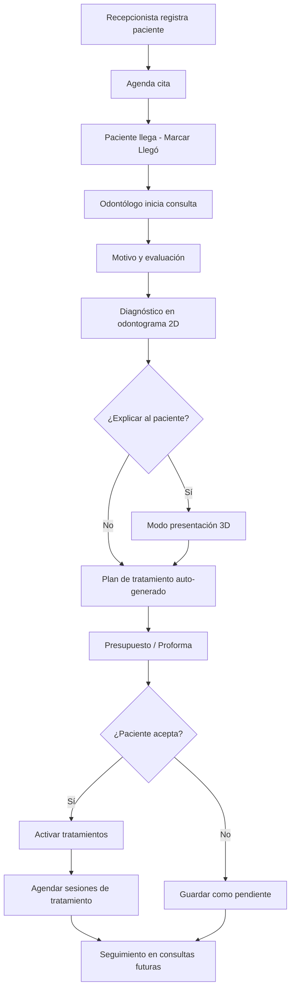

# Dental Studio — Arquitectura del Sistema

> Sistema odontológico local completo orientado al flujo clínico:  
> **Consulta → Diagnóstico → Odontograma → Tratamiento → Presupuesto → Proforma → Reserva → Seguimiento**

---

## 1. Visión general

**Dental Studio** es una aplicación de escritorio/web local para clínicas odontológicas. No es un CRUD de pacientes: es un **estudio clínico digital** que conecta el odontograma con presupuestos, proformas y agenda.

| Principio | Descripción |
|-----------|-------------|
| **Local-first** | SQLite + archivos en disco. Sin dependencia de internet. |
| **Flujo clínico unificado** | Una sola fuente de verdad: lo marcado en el odontograma alimenta tratamientos y presupuestos. |
| **UI premium** | Estética SaaS moderna (referencia: Dentlo, Zendenta). Sidebar minimalista, tarjetas, modo claro/oscuro. |
| **Presentación al paciente** | Modo especial con 3D y lenguaje amigable para explicar diagnósticos. |

---

## 2. Arquitectura técnica

```
┌─────────────────────────────────────────────────────────────┐
│                    DENTAL STUDIO (Electron)                  │
├─────────────────────────────────────────────────────────────┤
│  CAPA DE PRESENTACIÓN                                        │
│  React 18 + Vite + TypeScript + Tailwind + shadcn/ui        │
│  Framer Motion · FullCalendar · React Three Fiber            │
├─────────────────────────────────────────────────────────────┤
│  CAPA DE ESTADO                                              │
│  Zustand (UI global) · TanStack Query (datos servidor)       │
├─────────────────────────────────────────────────────────────┤
│  CAPA DE API LOCAL                                           │
│  NestJS (REST) · Validación con class-validator              │
├─────────────────────────────────────────────────────────────┤
│  CAPA DE DATOS                                               │
│  Prisma ORM · SQLite                                         │
├─────────────────────────────────────────────────────────────┤
│  ALMACENAMIENTO DE ARCHIVOS                                  │
│  /storage/patients · /quotes · /reports · /backups           │
└─────────────────────────────────────────────────────────────┘
```

### Stack recomendado

| Capa | Tecnología |
|------|------------|
| Frontend | React + Vite + TypeScript |
| Estilos | Tailwind CSS + shadcn/ui |
| Animaciones | Framer Motion |
| Calendario | FullCalendar |
| 3D | Three.js + React Three Fiber |
| Backend | NestJS |
| ORM | Prisma |
| Base de datos | SQLite |
| PDF | @react-pdf/renderer o pdfkit |
| Desktop | Electron (fase posterior) |

### Estructura de carpetas del monorepo

```
dental-studio/
├── apps/
│   ├── desktop/          # Electron shell
│   ├── web/              # React + Vite (frontend)
│   └── api/              # NestJS
├── packages/
│   ├── ui/               # Componentes compartidos shadcn
│   ├── types/            # Tipos TypeScript compartidos
│   └── dental-core/      # Lógica odontograma, FDI, precios
├── prisma/
│   └── schema.prisma
├── storage/              # Archivos locales (gitignored)
└── docs/
```

---

## 3. Roles y permisos

| Rol | Acceso |
|-----|--------|
| **Administrador** | Todo: usuarios, configuración, reportes, backup |
| **Odontólogo** | Consultas, odontograma, tratamientos, presupuestos, agenda propia |
| **Recepcionista** | Pacientes, reservas, confirmaciones, pagos básicos |
| **Asistente** | Consultas (solo lectura), odontograma (asistencia), documentos |

---

## 4. Menú lateral (Sidebar)

```
┌──────────────────────────────┐
│  🦷 Dental Studio            │
│  Clínica Dental [Nombre]      │
│  Av. Principal 123            │
├──────────────────────────────┤
│  CLÍNICA                      │
│  ◉ Dashboard                  │
│  ○ Agenda                     │
│  ○ Pacientes                  │
│  ○ Consultas                  │
│  ○ Odontograma                │
│  ○ Tratamientos               │
├──────────────────────────────┤
│  FINANZAS                     │
│  ○ Presupuestos               │
│  ○ Proformas                  │
│  ○ Pagos                      │
│  ○ Catálogo de precios        │
├──────────────────────────────┤
│  RECURSOS                     │
│  ○ Profesionales              │
│  ○ Consultorios               │
│  ○ Plantillas PDF             │
├──────────────────────────────┤
│  SISTEMA                      │
│  ○ Reportes                   │
│  ○ Backup                     │
│  ○ Configuración              │
├──────────────────────────────┤
│  ? Ayuda                      │
│  👤 Dr. Juan Pérez            │
│     Odontólogo                │
└──────────────────────────────┘
```

### Barra superior (Header global)

- Búsqueda global (`Cmd+K`): pacientes, citas, presupuestos
- Botón **+ Nueva consulta** / **+ Nueva cita**
- Notificaciones (recordatorios, presupuestos por vencer)
- Toggle modo claro/oscuro
- Perfil de usuario

---

## 5. Módulos y pantallas

### 5.1 Dashboard (`/dashboard`)

**KPIs principales (tarjetas):**
- Citas de hoy
- Pacientes atendidos (mes)
- Citas pendientes
- Presupuestos emitidos / aceptados
- Ingresos del mes
- Tratamientos en curso

**Widgets:**
- Agenda del día (lista compacta)
- Gráfico de ingresos vs gastos
- Tratamientos populares (donut chart)
- Alertas: alergias, presupuestos sin respuesta, citas sin confirmar

---

### 5.2 Pacientes (`/pacientes`)

| Pantalla | Ruta | Descripción |
|----------|------|-------------|
| Lista | `/pacientes` | Tabla con búsqueda, filtros, avatar |
| Nuevo | `/pacientes/nuevo` | Formulario registro |
| Perfil | `/pacientes/:id` | Vista 360° del paciente |

**Pestañas del perfil:**
1. **Resumen** — Datos, alertas (alergias), próxima cita
2. **Historial clínico** — Timeline de consultas
3. **Odontograma** — Último estado dental
4. **Tratamientos** — Activos y completados
5. **Presupuestos** — Historial de cotizaciones
6. **Documentos** — Fotos, radiografías, PDFs
7. **Pagos** — Adelantos y saldos

**Campos del paciente:**
- Datos personales (DNI, nombres, fecha nacimiento, género)
- Contacto (teléfono, email, dirección)
- Antecedentes médicos
- Alergias (destacadas en rojo)
- Contacto de emergencia
- Fotografía
- Notas internas

---

### 5.3 Consulta odontológica (`/consultas`)

| Pantalla | Ruta |
|----------|------|
| Lista | `/consultas` |
| Nueva | `/consultas/nueva?paciente=:id` |
| Detalle | `/consultas/:id` |

**Flujo de una consulta (wizard o tabs):**

```
[Paso 1: Motivo] → [Paso 2: Evaluación] → [Paso 3: Diagnóstico]
       ↓
[Paso 4: Odontograma] → [Paso 5: Plan tratamiento] → [Paso 6: Presupuesto]
       ↓
[Paso 7: Documentos] → [Paso 8: Cierre y próxima cita]
```

**Contenido por paso:**

| Paso | Campos |
|------|--------|
| Motivo | Motivo consulta, síntomas, duración |
| Evaluación | Examen extraoral/intraoral, signos vitales |
| Diagnóstico | Lista diagnósticos CIE/dentales, observaciones |
| Odontograma | Editor interactivo (ver §6) |
| Plan | Tratamientos sugeridos auto-generados desde odontograma |
| Presupuesto | Líneas editables, descuento, vigencia |
| Documentos | Fotos intraorales, radiografías |
| Cierre | Resumen, firma digital, agendar seguimiento |

---

### 5.4 Odontograma interactivo (`/odontograma/:consultaId`)

**Layout:**

```
┌─────────────────┬──────────────────────────────────────────┐
│ Catálogo        │         Odontograma visual               │
│ Diagnósticos    │   Arcada superior (18-28)                │
│ ─────────────   │   Arcada inferior (48-38)                │
│ Caries #16      │                                          │
│ Endodoncia #26  │   [Selección de superficies:            │
│                 │    D · O · M · V · P/L]                  │
│ Catálogo        │                                          │
│ Procedimientos  │                                          │
│ ─────────────   │                                          │
│ Restauración 16 │                                          │
│ Endodoncia 26   │                                          │
│                 │                                          │
│ [Guardar]       │   Panel lateral: Pieza 16                │
│                 │   Diagnóstico: Caries                    │
│                 │   Tratamiento: Restauración              │
│                 │   Prioridad: Alta · S/ 180               │
└─────────────────┴──────────────────────────────────────────┘
```

**Estados dentales (colores):**

| Estado | Color | Código |
|--------|-------|--------|
| Sin registro | Gris | `#94a3b8` |
| Sano | Verde | `#22c55e` |
| Caries | Rojo | `#ef4444` |
| Restauración | Azul | `#3b82f6` |
| Endodoncia | Púrpura | `#a855f7` |
| Extracción | Gris oscuro | `#475569` |
| Implante | Naranja | `#f97316` |
| Corona | Teal | `#14b8a6` |
| Fractura | Rosa | `#ec4899` |
| Ausente | Negro | `#1e293b` |

**Notación FDI:** 11-18, 21-28 (superior) · 31-38, 41-48 (inferior)

**Superficies:** Distal (D), Oclusal/Incisal (O), Mesial (M), Vestibular (V), Palatino/Lingual (P/L)

---

### 5.5 Modelo 3D (`/odontograma-3d/:consultaId`)

- Modelo 3D rotatable de dentadura completa
- Selección de pieza → panel con diagnóstico y tratamiento
- Modo **Presentar al paciente**: UI simplificada, texto amigable, sin jerga médica
- Resaltado de piezas afectadas con colores del odontograma 2D

---

### 5.6 Presupuestos y proformas

| Pantalla | Ruta |
|----------|------|
| Lista presupuestos | `/presupuestos` |
| Editor | `/presupuestos/:id` |
| Vista proforma | `/presupuestos/:id/proforma` |
| Folleto paciente | `/presupuestos/:id/folleto` |

**Editor de presupuesto:**

| Tratamiento | Pieza | Cant. | Precio unit. | Subtotal |
|-------------|-------|-------|--------------|----------|
| Restauración | 16 | 1 | S/ 180 | S/ 180 |
| Endodoncia | 26 | 1 | S/ 650 | S/ 650 |
| Corona | 26 | 1 | S/ 900 | S/ 900 |

- Descuento (% o monto)
- Adelanto / Saldo
- Forma de pago
- Número de cuotas
- Vigencia
- Observaciones
- Estados: Borrador · Enviado · Aceptado · Rechazado · Vencido

**Acciones:**
- Generar PDF proforma
- Generar folleto explicativo para paciente
- Enviar (email local / imprimir)
- Convertir a plan de tratamiento activo

---

### 5.7 Agenda (`/agenda`)

**Vistas:** Lista · Mensual · Semanal (FullCalendar)

**Estados de cita:**
- Programada
- Confirmada
- En sala de espera
- Atendida
- Reprogramada
- Cancelada
- No asistió

**Panel lateral al seleccionar cita:**
- Datos del paciente
- Tratamiento / motivo
- Timeline del tratamiento en curso
- Botones: Llegó · Reprogramar · Cancelar · Iniciar consulta

**Funcionalidades:**
- Drag & drop para reprogramar
- Filtro por odontólogo / consultorio
- Línea de hora actual
- Bloques de disponibilidad

---

### 5.8 Reservas (`/reservas/nueva`)

Formulario para recepcionista:
- Paciente (búsqueda o nuevo)
- Odontólogo
- Consultorio
- Fecha y hora
- Duración
- Motivo / tratamiento
- Estado inicial

---

### 5.9 Catálogo de precios (`/catalogo`)

- Tratamientos predefinidos con precio base
- Categorías: Preventivo, Restaurativo, Endodoncia, Prótesis, Ortodoncia, Cirugía
- Vinculación automática odontograma → ítem de catálogo

---

### 5.10 Configuración (`/configuracion`)

- Datos de la clínica (nombre, logo, dirección, RUC)
- Usuarios y roles
- Horarios de atención
- Consultorios
- Plantillas PDF (proforma, receta, consentimiento)
- Moneda (S/)
- Backup / restauración
- Tema (claro/oscuro por defecto)

---

## 6. Flujo principal del paciente



---

## 7. Modelo de datos (Prisma)

```prisma
// Entidades principales

model Clinica {
  id          String   @id @default(cuid())
  nombre      String
  direccion   String?
  telefono    String?
  logo        String?
  ruc         String?
  moneda      String   @default("PEN")
}

model Usuario {
  id        String   @id @default(cuid())
  email     String   @unique
  password  String
  nombre    String
  rol       Rol      @default(ODONTOLOGO)
  activo    Boolean  @default(true)
  citas     Cita[]
  consultas Consulta[]
}

enum Rol {
  ADMIN
  ODONTOLOGO
  RECEPCIONISTA
  ASISTENTE
}

model Paciente {
  id              String   @id @default(cuid())
  codigo          String   @unique  // P000001
  dni             String?
  nombres         String
  apellidos       String
  fechaNacimiento DateTime?
  genero          String?
  telefono        String?
  email           String?
  direccion       String?
  alergias        String?
  antecedentes    String?
  foto            String?
  notas           String?
  consultas       Consulta[]
  citas           Cita[]
  presupuestos    Presupuesto[]
  documentos      Documento[]
  createdAt       DateTime @default(now())
}

model Consulta {
  id            String   @id @default(cuid())
  pacienteId    String
  paciente      Paciente @relation(fields: [pacienteId], references: [id])
  odontologoId  String
  odontologo    Usuario  @relation(fields: [odontologoId], references: [id])
  fecha         DateTime @default(now())
  motivo        String?
  evaluacion    String?
  observaciones String?
  estado        EstadoConsulta @default(EN_CURSO)
  diagnosticos  Diagnostico[]
  odontograma   OdontogramaEntrada[]
  presupuesto   Presupuesto?
  documentos    Documento[]
}

enum EstadoConsulta {
  EN_CURSO
  COMPLETADA
  CANCELADA
}

model OdontogramaEntrada {
  id           String   @id @default(cuid())
  consultaId   String
  consulta     Consulta @relation(fields: [consultaId], references: [id])
  pieza        Int      // FDI: 11-48
  superficie   String?  // D, O, M, V, P, L
  diagnostico  String   // caries, restauracion, etc.
  tratamiento  String?
  prioridad    Prioridad @default(MEDIA)
  observacion  String?
  enTratamiento Boolean @default(false)
}

enum Prioridad {
  BAJA
  MEDIA
  ALTA
  URGENTE
}

model CatalogoTratamiento {
  id          String  @id @default(cuid())
  codigo      String  @unique
  nombre      String
  categoria   String
  precioBase  Decimal
  duracionMin Int?
  activo      Boolean @default(true)
}

model Presupuesto {
  id            String   @id @default(cuid())
  numero        String   @unique  // PRO-000125
  pacienteId    String
  paciente      Paciente @relation(fields: [pacienteId], references: [id])
  consultaId    String?  @unique
  consulta      Consulta? @relation(fields: [consultaId], references: [id])
  fecha         DateTime @default(now())
  vigencia      DateTime?
  subtotal      Decimal
  descuento     Decimal  @default(0)
  total         Decimal
  adelanto      Decimal  @default(0)
  saldo         Decimal
  estado        EstadoPresupuesto @default(BORRADOR)
  observaciones String?
  detalles      PresupuestoDetalle[]
}

enum EstadoPresupuesto {
  BORRADOR
  ENVIADO
  ACEPTADO
  RECHAZADO
  VENCIDO
}

model PresupuestoDetalle {
  id            String      @id @default(cuid())
  presupuestoId String
  presupuesto   Presupuesto @relation(fields: [presupuestoId], references: [id])
  tratamiento   String
  pieza         Int?
  cantidad      Int         @default(1)
  precioUnitario Decimal
  subtotal      Decimal
  catalogoId    String?
}

model Cita {
  id            String   @id @default(cuid())
  pacienteId    String
  paciente      Paciente @relation(fields: [pacienteId], references: [id])
  odontologoId  String
  odontologo    Usuario  @relation(fields: [odontologoId], references: [id])
  consultorioId String?
  fechaInicio   DateTime
  fechaFin      DateTime
  motivo        String?
  tratamiento   String?
  estado        EstadoCita @default(PROGRAMADA)
  notas         String?
}

enum EstadoCita {
  PROGRAMADA
  CONFIRMADA
  EN_ESPERA
  ATENDIDA
  REPROGRAMADA
  CANCELADA
  NO_ASISTIO
}

model Documento {
  id         String   @id @default(cuid())
  pacienteId String
  paciente   Paciente @relation(fields: [pacienteId], references: [id])
  consultaId String?
  consulta   Consulta? @relation(fields: [consultaId], references: [id])
  tipo       TipoDocumento
  nombre     String
  ruta       String
  createdAt  DateTime @default(now())
}

enum TipoDocumento {
  FOTO
  RADIOGRAFIA
  PDF
  CONSENTIMIENTO
  OTRO
}
```

---

## 8. Almacenamiento de archivos

```
storage/
├── patients/
│   └── P000001/
│       ├── photos/
│       ├── radiographs/
│       └── documents/
├── quotes/
│   └── PRO-000125.pdf
├── reports/
└── backups/
    └── 2026-09-08_backup.db
```

---

## 9. API REST (endpoints principales)

| Método | Ruta | Descripción |
|--------|------|-------------|
| POST | `/auth/login` | Inicio de sesión |
| GET | `/dashboard/stats` | KPIs del dashboard |
| CRUD | `/pacientes` | Gestión de pacientes |
| CRUD | `/consultas` | Consultas clínicas |
| GET/POST | `/consultas/:id/odontograma` | Entradas odontograma |
| POST | `/consultas/:id/generar-presupuesto` | Auto-generar desde odontograma |
| CRUD | `/presupuestos` | Presupuestos |
| GET | `/presupuestos/:id/pdf` | Generar PDF |
| GET | `/presupuestos/:id/folleto` | Folleto paciente |
| CRUD | `/citas` | Agenda |
| GET | `/agenda/semana` | Vista semanal |
| CRUD | `/catalogo/tratamientos` | Catálogo de precios |
| POST | `/backup/export` | Exportar backup |
| POST | `/backup/import` | Restaurar backup |

---

## 10. Integración odontograma ↔ presupuesto

**Regla de negocio central:**

```
Al guardar entrada odontograma:
  pieza + diagnostico + tratamiento
    → buscar en CatalogoTratamiento
    → agregar/actualizar línea en PresupuestoDetalle (si consulta tiene presupuesto activo)
    → recalcular totales
```

**Ejemplo:**

```typescript
// packages/dental-core/src/presupuesto-auto.ts
function sincronizarPresupuestoDesdeOdontograma(
  entradas: OdontogramaEntrada[],
  catalogo: CatalogoTratamiento[]
): PresupuestoDetalle[] {
  return entradas
    .filter(e => e.tratamiento)
    .map(e => ({
      tratamiento: e.tratamiento!,
      pieza: e.pieza,
      cantidad: 1,
      precioUnitario: catalogo.find(c => c.nombre === e.tratamiento)?.precioBase ?? 0,
      subtotal: /* precioUnitario * cantidad */
    }));
}
```

---

## 11. Modo "Presentar al paciente"

Pantalla fullscreen con:
- Fondo suave, tipografía grande
- Modelo 3D centrado
- Texto en lenguaje simple (sin "caries oclusal" → "pequeña lesión en el diente")
- Piezas resaltadas como chips `[ 16 ] [ 26 ]`
- Total del tratamiento recomendado
- Botón "Ver detalle del plan"
- Controlado por el odontólogo (no interactivo para el paciente salvo rotación 3D)

---

## 12. Plan de implementación por fases

| Fase | Entregables | Duración estimada |
|------|-------------|-------------------|
| **1 — Base** | Login, layout, dashboard, pacientes, usuarios, config clínica | 2-3 semanas |
| **2 — Clínica** | Consultas, historial, odontograma 2D interactivo | 3-4 semanas |
| **3 — Presupuestos** | Catálogo, cotizaciones, proformas PDF, folletos | 2-3 semanas |
| **4 — Agenda** | Calendario FullCalendar, reservas, estados de cita | 2 semanas |
| **5 — 3D** | Modelo dentadura, selección, modo presentación | 3-4 semanas |
| **6 — Pro** | Reportes, estadísticas, backup, auditoría, Electron | 2-3 semanas |

---

## 13. Paleta de diseño UI

| Token | Claro | Oscuro |
|-------|-------|--------|
| Primary | `#0ea5e9` (sky-500) | `#38bdf8` |
| Background | `#f8fafc` | `#0f172a` |
| Card | `#ffffff` | `#1e293b` |
| Border | `#e2e8f0` | `#334155` |
| Success | `#22c55e` | `#4ade80` |
| Danger | `#ef4444` | `#f87171` |
| Muted | `#64748b` | `#94a3b8` |

**Tipografía:** Inter o Geist Sans  
**Border radius:** `rounded-xl` (12px) en tarjetas  
**Sombras:** `shadow-sm` sutiles

---

## 14. Referencias visuales

Las interfaces deben inspirarse en:
- **Dentlo** — Dashboard con KPIs, gráficos de ingresos, sidebar categorizado
- **Zendenta** — Agenda semanal, panel de detalle de cita, timeline de tratamiento
- **Odontograma clínico** — Catálogo lateral + diagrama FDI + superficies
- **Green Family Dental** — Flujo de reserva con calendario limpio
